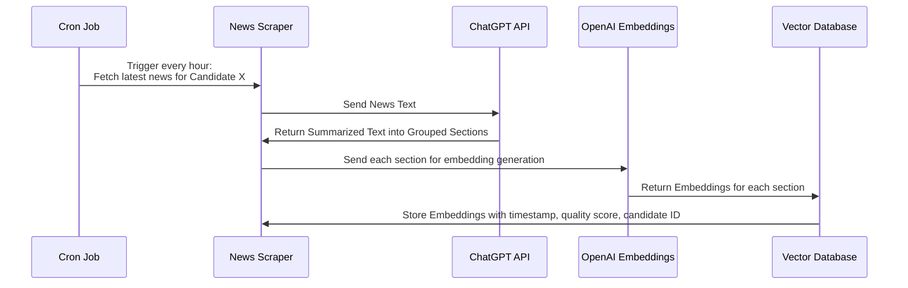
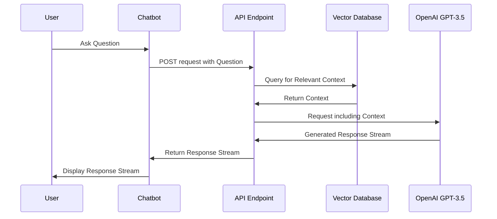

# We have two main flows to generate and consume the memory

## Cornjob to seed VectorDB new memory

```mermaid
sequenceDiagram
    participant CJ as Cron Job
    participant Scraper as News Scraper
    participant CGPT as ChatGPT API
    participant OE as OpenAI Embeddings
    participant VD as Vector Database

    CJ->>Scraper: Trigger every hour:<br> Fetch latest news for Candidate X
    Scraper->>CGPT: Send News Text
    CGPT->>Scraper: Return Summarized Text into Grouped Sections
    Scraper->>OE: Send each section for embedding generation
    OE->>VD: Return Embeddings for each section
    VD->>Scraper: Store Embeddings with timestamp, quality score, candidate ID
```

## Chat Completion Flow (Appending context to prompt)

```mermaid
sequenceDiagram
    participant User as User
    participant CB as Chatbot
    participant API as API Endpoint
    participant VD as Vector Database
    participant GPT3 as OpenAI GPT-3.5

    User->>CB: Ask Question
    CB->>API: POST request with Question
    API->>VD: Query for Relevant Context
    VD->>API: Return Context
    API->>GPT3: Request including Context
    GPT3->>API: Generated Response Stream
    API->>CB: Return Response Stream
    CB->>User: Display Response Stream
```
